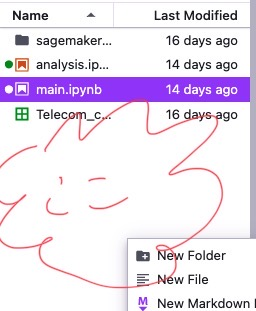

# Python3入門

# 福富哲平
***


# 前書き
## はじめに
みなさんは，コンピュータを制御する方法だったり，IT技術を使って何かを解決するといったことに興味を持っているだろうか．Pythonには，あなたのそんな夢を解決するための方法がたくさん用意されており，また，早く実装できることがある．そして，コミュニティがとても大きく，質問をすると解決できたりといったことがある．

本書では，最近話題のプログラミング言語Pythonの基礎の基礎の学習のお手伝いをさせていただく．Pythonを習得し，夢へと近づきましょう！

## ソースコード，環境
ソースコードは全てGithubで入手することが可能です．
Githubからファイルをダウンロードし，ぜひ実行してみてください．本書に書くプログラムもエラーなく動くことを確認しますが，環境によって動かない可能性があります．

筆者の環境は以下の通りです
OS: macOS Monterey
Python3.9.4
https://github.com/Fu-Te/python_learning

## 免責
本プログラムは全て筆者環境やクラウド環境において，動くことを確認していますが，動かない可能性があります．
本プログラムを改造等し，損害を被ったり，警察沙汰になっても筆者は責任を負いかねます．

***

## なぜPythonなのか
PythonだとAI開発を素早く行うためのライブラリがたくさん存在しており，AI開発の標準的な言語であり，また文法がとてもわかりやすいことからとても人気な言語となっている．
機械学習以外の分野，Web系やコンピュータ制御やネットワーク系もPythonで実装可能である．
さまざまな便利なツールも最終章で紹介する．

## 本書の対象とする人
プログラミングに関する知識がない人
Pythonの文法を知りたい人
これからプログラミングを頑張っていきたい人

## 本書の構成
本書では，実際に動かせるプログラムを”書き”動作させることでプログラミングへの理解進めていく形式を取る．
Pythonはインタープリタ言語と呼ばれ，１行ずつプログラムが実行されるのでとてもわかりやすく学ぶことができる．
インタープリタ言語の対となるのがコンパイラ言語(C,Rust,C++等)があるが，インタープリタ言語で動きを学んでから，コンパイラ言語の習得を目指しても遅くない．

***

# プログラミングとはどうやるのだろうか？
筆者もまだプログラミングを始めてそう長くないが私のプログラムの書き方やエラーにぶつかった時の対処法を記す．
私自身，高校生の時にプログラミングを始め，最初は何が何だか全くわからなかった．エラーが出てもグーグル先生に聞くことをせず，すぐに本を読み，基礎から学習するということを何度も繰り返し，Pythonに関する本を5冊程度読むということを繰り返した．しかし，これではいつまで経っても何も作れないままなのである．なぜなら，それらの本は基礎しか教えてくれないからである．
この本でPythonの基礎を学んだら，ぜひ何か作りたいものを定め，実装してみてほしい．実装をする途中でわからないことや，エラーに何度も出会うだろう．しかし，そのエラーを調べ，なぜできないのか，なぜできたのかを考えることによって私は成長したという実感を得ることができ，また実装する力もついてきたと思う．
せっかくインタープリタ言語を使っているので，トライアンドエラーを繰り返し成長してほしい．

***

# Pythonを使えるようにする(環境構築)
WindowsとMacosに分けて説明する．必要な部分をつまみながら環境構築をしてみてほしい．
本書では，特にPythonのバージョンを指定しないが，筆者はPython3.9.4を利用している．

## Windows
1.スタートメニューを開き，「Microsoft Store」と入力し，ストアを開く．

2.ストアが開いたら，右上の検索を選択し，「Python」と入力してください．
3.Pythonのダウンロードとインストールが完了したら，またスタートメニューを開き，「Windows PowerShell」を開いてください．それを開いたら```Python --version```と入力し，Python3がインストールされていることを確認してください．

上記の手法でできなかった場合は，ググってみてください！
参考リンクも残しておきます．
https://docs.microsoft.com/ja-jp/windows/python/beginners

## macos
macにはPythonが既に入っています．ターミナルを開き，```python --version```としてみてください．バージョンが表示されるはずです！

古いバージョンだったりしたら，新しく入れ直すことも可能です．
macosにはHomebrewという便利なツールがあります．これからプログラミングを続けていく中で，かなり便利なツールなので，入れてみても損はないと思います．気になる方は調べてみてください！
Homebrew: https://brew.sh/

## バージョン管理ツールAnaconda
Pythonにはたくさんのライブラリがあります．そのライブラリを管理したり，Pythonのバージョンごとに環境を作ることができる最強のツールであるAnacondaの導入方法を紹介します！これはMac,Win共通です！

https://www.anaconda.com/products/individual
上記のリンクからAnacondaをダウンロードし，お使いのコンピュータにインストールしてください！

次の章で説明するJupyterNotebookはAnacondaを入れることによって利用できるようになります！

***

# JupyterNotebookの使い方を学ぶ
JupyterNotebookは統合開発環境と呼ばれるものです．ブラウザ上で動き，プログラムを書いて実行するとすぐに結果が出力されるという優れもので，筆者もよく使います．
JupyterNotebookはオープンソースであり，無償利用が可能，豊富なライブラリが使える，実行結果がすぐに出るという3本柱でPythonを使う人にとっては神的なツールであります！！

はいはい，わかったよ．んでどうやって使うんだって話ですよね．．．！
このツール，私が知る限りだと４つくらい使い方があります．．．！！
1.GoogleColaboratory

2.AWS SageMaker

3.AnacondaについてるJupyterNotebook

4.VisualStudioCodeの拡張機能を使う


***

前のページの通り4通りですね．．．それぞれメリット，デメリットがあるので紹介しますね．
1,2は最近流行りのクラウド技術を用いたものです．どちらも無料で使うことができます．環境構築が不要で，自分のパソコンにアレ入れてーこれ入れてーとかっていっためんどくさい作業がなくなります！！
3,4は自分のパソコンに計算をさせる感じですね．いいところはローカルで実行できるってところですね．データがデカすぎてクラウドに上げられないよ，とかクラウドより高性能だし！！って人はローカルもいいですね．環境構築が鬼門になりそうですが，それも経験の一つです！
何いってるのか全然理解できん．．．って人は，調べてみてください！！

ちなみに，筆者は2,3,4を使ってます！

今回，本書では，2と3でやってみてほしいなーって感じなので，使い方について説明しますね！

***

## AWS SageMaker
こちらのツール，環境構築が必要なく利用できるので，コンピュータわからんし，何入れたらいいかわからん！AnacondaもめんどいしPython入れるのもめんどくさって人にめっちゃおすすめです！！
ただ，SageMakerって申請して次の日くらいから使えるようになるので，そこだけご了承をって感じですが．．．
https://studiolab.sagemaker.aws/

上のリンクに飛んでもらって，「Request free account」って押して，色々入力して，「Submit Request」って押してください．多分，登録したメールに確認メールきて，申請が承諾されるとアカウントが発行されるはずです．そしたら右上にあるSign inを押して，ログインしたら使えるようになります！

***


ログインするとこんな感じになります！
Select compute typeっていうのCPUとGPUあるんですけど，CPUの方が得意な計算とGPUの方が得意な計算っていうのがあって，場合によって使い分けます．本書で取り組むものはCPUで十分です！どれだけ使っても無料なので，どんどん使っちゃってください！
使えるようになるまでをまとめます
1.アカウント作成リクエストを送る
2.サインインする
3.GPUかCPU選ぶ
4.Start runtimeおす
5.Open projectを押す
ってな感じでサービス使えるようになりまーす．

***
### SageMaker使ってみる

Open project押すとこんな感じのタブが開く．筆者の環境の場合，すでにファイルがあるが，みなさんのところにはまだないと思う．

**ここ**ってところを右クリックして，「New File」押して，「filename.ipynb」で作成すると，JupyterNotebook形式でコード書けます！「filename」は自分でファイルの名前決めてください！拡張子はipynbにしてください．

ちなみに，サンプルコードを実行したいなーって時は，Githubからダウンロードして，紫の＋ボタンの２つ右にあるアップロードするボタンがあるのでそこを押して，アップロードしたいファイルを選択したらサンプルコードを使えるようになります！

これでSageMakerの一通りの使い方はおしまいです！わからないことがあったら調べてみてください！


***

## AnacondaのJupyterNotebook
Anacondaに付属しているJupyterNotebookはローカル環境で動きます！
使い方は以下の通り
1.Anacondaを導入する
2.Anacondaを起動する
3.JupyterNotebookのLaunchを押す

少し待つとWEBブラウザに開きます．
ここで，プログラムがあるフォルダや，これからプログラムを作りたいフォルダをクリックして

こんな感じになる．
多分，まだファイル作ってない人は空のフォルダになっているので，画像の右上の新規ってところ押して，Python3を選択してファイル作ってください！そしたらUntitled.ipynbっていうファイルができます！

この画像のUntitledってところクリックするとファイルの名前変えられます！

これでとりあえず設定の説明を終わりにします！

***

## JupyterNotebookの基本的な使い方

プログラムは```print('Hello,World')```って書いてあるところに書きます！
このコードを動かすには，▷押すと動かせます．WindowsだとCtrl+Enterで，MacだとCommand+Enterで動かせるはずです！
で，新しい行を追加したい時には＋マーク押してください！

基本的なことはここまでで，後は使いながら慣れていきましょう．．．
〜〜したいけどできないのかな？とか疑問に思ったらすぐに検索してください！！
例文「JupyterNotebook，新しい行追加」みたいな感じで！

***


# 1.Pythonの基本文法
サンプルコード名:1_python.ipynb

早速，Pythonを使ったプログラミングに入っていきましょう！！
前にも説明した通り，Pythonはインタープリタ言語で，１行ずつ実行されるのが特徴です！！
プログラミング学習で一番最初にやることといえば，「Hello,World!」を表示することですね！
```python
print('Hello,World!')
```
たったこの１行で実現できてしまう．．すごい！！
初めてなので，例を示しときます！

こんな感じに入力して，Runってしてみてください！
プログラムを書いてて，そのプログラムがどんな処理をしているのかって他の人からわかりにくいですよね？そんな時に役に立つのが，コメントというシステムです
```python
# hello,worldを表示
print('Hello,World')
```
コメントの始めに#をつけることでコメントを記入することだってできちゃいます！
面白いのはこれからです！次に移ります！

***

# 2.変数
サンプルコード名:2_variable.ipynb

早速，変数っていうプログラムを理解する上手とても大切な概念を説明します！
## 変数ってなに？
まず変数って何ってところですよね．
変数はPythonに限らずプログラミング言語では何かしらの値を格納するために用意されるもののことです．何回も繰り返し使ったり，後から呼び出したりとかする時に使うことが多いです！
では，実際に変数を使ってみましょう！

## 変数の定義
まず，変数を定義して，使えるようにします！
```python
a=2
print(a)
```
を実行してみてください！
aって結果が出力されそうですが，2が出力されましたよね．printでaの中身を出力しています！
例えば，レジシステムを構築したいといったことがあるとしましょう．
```python
orange = 'オレンジ'
apple = 'りんご'
orange_price = 100
apple_price = 200
print(orange,orange_price)
print(apple,apple_price) 
```
を実行してみてください！orangeにはオレンジ，orange_priceには100が入っていることがわかります．
ここで大事なことがあります．**数値を定義する時には''が必要なかったが，文字列を入力する時には''が必要なことです**
文字列や数値って何？っていうのは，３章のデータ型のところで説明します！


## 変数名はどうやって決めるの？
他の人がプログラムを見た時，変数名を見てこの変数がどんな意味を持っていて，どんな役割なのか，すぐにわかることってとっても大切です．
プログラミングをする人たちの間では「自分で書いたコードでも誰が書いたかわからない」みたいなことわざがあります．つまり，いつ見ても誰が見てもわかるようにした方がより良い変数名であるといえます．
基本的に，変数名は日本語ではなく，英語で付けられることが多いですね．
ここら辺の話は，プログラミングに慣れてから追々考えればいいお話かなと個人的には思うので，ここら辺にしておきます！

***

## 変数の値を更新する
変数の値は更新することができます．
```python
orange_price = 100
print(orange_price)
orange_price = 200
print(orange_price)
```
これを実行すると100と200が順番に出力されます！プログラムは上から順に実施され，その時に一番新しい値を出力します．
## 変数を別の変数に代入する
変数に定義した内容を別の変数の中に入れることもできます！
```python
orange = 'オレンジ'
print(orange)
apple = 'りんご'
orange = apple
print(orange)
```
このコードを実行するとオレンジの後りんごが出力され，変数の中に別の変数を入れることができるということに気づくでしょう！

## 変数どうしで計算する
前に説明したレジシステムを使って説明します．
オレンジとりんご1つずつ購入し，その合計金額を求めるコードを提示します
```python
orange = 100
apple = 200
total = orange*1 + apple*1
print(total)
```
このコードを実行すると300が出力されるはずです．
追いやすく整理します
$$total = 100*1 + 200*1$$
となって計算されているのです！

また，文字同士を連結させることもできます！
```python
orange = 'オレンジ'
apple = 'りんご'
orange_apple = orange + apple
print(orange_apple)
```
この性質を利用すれば，文字を何回も出力したいときは変数名*回数といったようにすれば，指定した回数だけ文字列を出力することもできます！
サンプルコードには，他にもコードを提示しているのでみてみてください！

***


# 3.データ型について
なんだいきなり，データ型って？みんなそうなるはずです！
Pythonではあまりデータ型を意識せずともプログラムを書くことができるようになっていますが，そのうち型が違いますといったエラーが出てPythonに怒られるでしょう．その日が絶対に来るので説明しておきます．

## 文字列

# 4.数値

# 5.文字列


# 6.条件分岐/繰り返し

# 7.リスト/タプル/辞書

# 8.関数

# 9.組み込み関数

# 10.正規表現

# 11.importの使い方

# 12.便利なツール，ライブラリ，パッケージ等

# 13.おわりに

# 14.筆者について
福富哲平
中央大学国際情報学部３年(2021年)
高校２年生からPythonでコードを書き始めた．


# calculate.ipynb
pythonにおける四則演算
# variable.ipynb
変数についての知識
変数の注意点
1.大文字と小文字は区別される
2.数字、記号は先頭の文字にできない
3.予約後は使用できない(python予約語で調べると)
4.英単語で変数名を作ると良い
# compare_actuators.ipynb
比較演算子
大小を判断する
if,whileなどで使う
True or Falseで判断される
# data_type.ipynb
データ型について
int 整数型
float 浮動小数
str　文字列
complex 複素数
bool True or Falseを表すもの

list リスト型　複数の値をまとめて扱いたい場合に使用する。ここでいう1,2,3は要素と呼ばれ、一番目、二番目などはインデックスと呼ばれる。また、0,1,2番目となっていく。
dict 辞書型
tuple タプル型 要素を変化させることができないもの

# conditonal.ipynb
if,while,forの説明
ifは条件分岐をする。例えば、テストの点数が何点以上じゃないと不合格など、whileは条件式がTrueの間は繰り返し続ける。forは範囲内の時繰り返し続ける
fizzbuzzとは数値が15の時fizzbuzz,5のときbuzz,3の時fizzとなるようにする。    