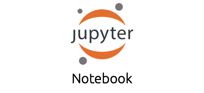

# Python3入門の入門

# 福富哲平
***


# 前書き
## はじめに
みなさんは，コンピュータを制御する方法だったり，IT技術を使って何かを解決するといったことに興味を持っているだろうか．Pythonには，あなたのそんな夢を解決するための方法がたくさん用意されており，また，早く実装できることがある．そして，コミュニティがとても大きく，質問をすると解決できたりといったことがある．
また，***プログラミングにおいて，調べる力（ググる力）はとても大切**だと私は考えています．そのため，基礎については例示するが，それ以上のことは調べてもらうように構成しています．調べる力，調べ方を養っていきましょう．

本書では，最近話題のプログラミング言語Pythonの基礎の基礎の学習のお手伝いをさせていただく．Pythonを習得し，夢へと近づきましょう！

## ソースコード，環境
ソースコードは全てGithubで入手することが可能です．
Githubからファイルをダウンロードし，ぜひ実行してみてください．本書に書くプログラムもエラーなく動くことを確認しますが，環境によって動かない可能性があります．

筆者の環境は以下の通りです
OS: macOS Monterey
Python3.9.4
https://github.com/Fu-Te/python_learning

## 免責
本プログラムは全て筆者環境やクラウド環境において，動くことを確認していますが，動かない可能性があります．
本プログラムを改造等し，損害を被ったり，警察沙汰になっても筆者は責任を負いかねます．

***

## なぜPythonなのか
PythonだとAI開発を素早く行うためのライブラリがたくさん存在しており，AI開発の標準的な言語であり，また文法がとてもわかりやすいことからとても人気な言語となっている．
機械学習以外の分野，Web系やコンピュータ制御やネットワーク系もPythonで実装可能である．
さまざまな便利なツールも最終章で紹介する．

## 本書の対象とする人
プログラミングに関する知識がない人
Pythonの文法を知りたい人
これからプログラミングを頑張っていきたい人

## 本書の構成
本書では，実際に動かせるプログラムを”書き”動作させることでプログラミングへの理解進めていく形式を取る．
Pythonはインタープリタ言語と呼ばれ，１行ずつプログラムが実行されるのでとてもわかりやすく学ぶことができる．
インタープリタ言語の対となるのがコンパイラ言語(C,Rust,C++等)があるが，インタープリタ言語で動きを学んでから，コンパイラ言語の習得を目指しても遅くない．

***

# プログラミングとはどうやるのだろうか？
筆者もまだプログラミングを始めてそう長くないが私のプログラムの書き方やエラーにぶつかった時の対処法を記す．
私自身，高校生の時にプログラミングを始め，最初は何が何だか全くわからなかった．エラーが出てもグーグル先生に聞くことをせず，すぐに本を読み，基礎から学習するということを何度も繰り返し，Pythonに関する本を5冊程度読むということを繰り返した．しかし，これではいつまで経っても何も作れないままなのである．なぜなら，それらの本は基礎しか教えてくれないからである．
この本でPythonの基礎を学んだら，ぜひ何か作りたいものを定め，実装してみてほしい．実装をする途中でわからないことや，エラーに何度も出会うだろう．しかし，そのエラーを調べ，なぜできないのか，なぜできたのかを考えることによって私は成長したという実感を得ることができ，また実装する力もついてきたと思う．
せっかくインタープリタ言語を使っているので，トライアンドエラーを繰り返し成長してほしい．

***

# Pythonを使えるようにする(環境構築)
WindowsとMacosに分けて説明する．必要な部分をつまみながら環境構築をしてみてほしい．
本書では，特にPythonのバージョンを指定しないが，筆者はPython3.9.4を利用している．

## Windows
1.スタートメニューを開き，「Microsoft Store」と入力し，ストアを開く．

2.ストアが開いたら，右上の検索を選択し，「Python」と入力してください．
3.Pythonのダウンロードとインストールが完了したら，またスタートメニューを開き，「Windows PowerShell」を開いてください．それを開いたら```Python --version```と入力し，Python3がインストールされていることを確認してください．

上記の手法でできなかった場合は，ググってみてください！
参考リンクも残しておきます．
https://docs.microsoft.com/ja-jp/windows/python/beginners

## macos
macにはPythonが既に入っています．ターミナルを開き，```python --version```としてみてください．バージョンが表示されるはずです！

古いバージョンだったりしたら，新しく入れ直すことも可能です．
macosにはHomebrewという便利なツールがあります．これからプログラミングを続けていく中で，かなり便利なツールなので，入れてみても損はないと思います．気になる方は調べてみてください！
Homebrew: https://brew.sh/

## バージョン管理ツールAnaconda
Pythonにはたくさんのライブラリがあります．そのライブラリを管理したり，Pythonのバージョンごとに環境を作ることができる最強のツールであるAnacondaの導入方法を紹介します！これはMac,Win共通です！

https://www.anaconda.com/products/individual
上記のリンクからAnacondaをダウンロードし，お使いのコンピュータにインストールしてください！

次の章で説明するJupyterNotebookはAnacondaを入れることによって利用できるようになります！

***

# JupyterNotebookの使い方を学ぶ
JupyterNotebookは統合開発環境と呼ばれるものです．ブラウザ上で動き，プログラムを書いて実行するとすぐに結果が出力されるという優れもので，筆者もよく使います．
JupyterNotebookはオープンソースであり，無償利用が可能，豊富なライブラリが使える，実行結果がすぐに出るという3本柱でPythonを使う人にとっては神的なツールであります！！
**jupyternotebookの拡張子は.ipynbですが，Pythonの拡張子は.pyです**
今回はわかりやすく.ipynbを使うのですが，コンピュータを制御する時などは.py形式の方が有用です．拡張子が異なりますが，どちらも同じPythonを用いているので文法等は同じです．
今回はプログラミング言語Pythonの習得を目的としているので，わかりやすい.ipynb形式を使います

はいはい，わかったよ．んでどうやって使うんだって話ですよね．．．！
このツール，私が知る限りだと４つくらい使い方があります．．．！！
1.GoogleColaboratory

2.AWS SageMaker

3.AnacondaについてるJupyterNotebook

4.VisualStudioCodeの拡張機能を使う


***

前のページの通り4通りですね．．．それぞれメリット，デメリットがあるので紹介しますね．
1,2は最近流行りのクラウド技術を用いたものです．どちらも無料で使うことができます．環境構築が不要で，自分のパソコンにアレ入れてーこれ入れてーとかっていっためんどくさい作業がなくなります！！
3,4は自分のパソコンに計算をさせる感じですね．いいところはローカルで実行できるってところですね．データがデカすぎてクラウドに上げられないよ，とかクラウドより高性能だし！！って人はローカルもいいですね．環境構築が鬼門になりそうですが，それも経験の一つです！
何いってるのか全然理解できん．．．って人は，調べてみてください！！

ちなみに，筆者は2,3,4を使ってます！

今回，本書では，2と3でやってみてほしいなーって感じなので，使い方について説明しますね！

***

## AWS SageMaker
こちらのツール，環境構築が必要なく利用できるので，コンピュータわからんし，何入れたらいいかわからん！AnacondaもめんどいしPython入れるのもめんどくさって人にめっちゃおすすめです！！
ただ，SageMakerって申請して次の日くらいから使えるようになるので，そこだけご了承をって感じですが．．．
https://studiolab.sagemaker.aws/

上のリンクに飛んでもらって，「Request free account」って押して，色々入力して，「Submit Request」って押してください．多分，登録したメールに確認メールきて，申請が承諾されるとアカウントが発行されるはずです．そしたら右上にあるSign inを押して，ログインしたら使えるようになります！

***


ログインするとこんな感じになります！
Select compute typeっていうのCPUとGPUあるんですけど，CPUの方が得意な計算とGPUの方が得意な計算っていうのがあって，場合によって使い分けます．本書で取り組むものはCPUで十分です！どれだけ使っても無料なので，どんどん使っちゃってください！
使えるようになるまでをまとめます
1.アカウント作成リクエストを送る
2.サインインする
3.GPUかCPU選ぶ
4.Start runtimeおす
5.Open projectを押す
ってな感じでサービス使えるようになりまーす．

***
### SageMaker使ってみる

Open project押すとこんな感じのタブが開く．筆者の環境の場合，すでにファイルがあるが，みなさんのところにはまだないと思う．

**Notebookのdefault:Python**ってところをクリックするとJupyterNotebook形式でコード書けます！

ちなみに，サンプルコードを実行したいなーって時は，Githubからダウンロードして，紫の＋ボタンの２つ右にあるアップロードするボタンがあるのでそこを押して，アップロードしたいファイルを選択したらサンプルコードを使えるようになります！

これでSageMakerの一通りの使い方はおしまいです！わからないことがあったら調べてみてください！


***

## AnacondaのJupyterNotebook
Anacondaに付属しているJupyterNotebookはローカル環境で動きます！
使い方は以下の通り
1.Anacondaを導入する
2.Anacondaを起動する
3.JupyterNotebookのLaunchを押す

少し待つとWEBブラウザに開きます．
ここで，プログラムがあるフォルダや，これからプログラムを作りたいフォルダをクリックして

こんな感じになる．
多分，まだファイル作ってない人は空のフォルダになっているので，画像の右上の新規ってところ押して，Python3を選択してファイル作ってください！そしたらUntitled.ipynbっていうファイルができます！

この画像のUntitledってところクリックするとファイルの名前変えられます！

これでとりあえず設定の説明を終わりにします！

***

## JupyterNotebookの基本的な使い方

プログラムは```print('Hello,World')```って書いてあるところに書きます！
このコードを動かすには，▷押すと動かせます．WindowsだとCtrl+Enterで，MacだとCommand+Enterで動かせるはずです！
で，新しい行を追加したい時には＋マーク押してください！

基本的なことはここまでで，後は使いながら慣れていきましょう．．．
〜〜したいけどできないのかな？とか疑問に思ったらすぐに検索してください！！
例文「JupyterNotebook，新しい行追加」みたいな感じで！

## .ipynb形式について
.ipynb形式だと，上の行の内容がしたの行にも続いています．普通，プログラムは全て完成させてから実行しますが，ipynb形式だと１行ずつでも実行でき，わかりやすいのが強みです．なので.py形式でなく.ipynb形式を用います．ここについての説明は難しいので，気になった方は
「ipynbとは」,「ipynb,py違い」みたいな感じで検索してみてください

***


# 1.Pythonの基本文法
サンプルコード名:1_python.ipynb

早速，Pythonを使ったプログラミングに入っていきましょう！！
前にも説明した通り，Pythonはインタープリタ言語で，１行ずつ実行されるのが特徴です！！
プログラミング学習で一番最初にやることといえば，「Hello,World!」を表示することですね！
```python
print('Hello,World!')
```
たったこの１行で実現できてしまう．．すごい！！
初めてなので，例を示しときます！

こんな感じに入力して，Runってしてみてください！
プログラムを書いてて，そのプログラムがどんな処理をしているのかって他の人からわかりにくいですよね？そんな時に役に立つのが，コメントというシステムです
```python
# hello,worldを表示
print('Hello,World')
```
コメントの始めに#をつけることでコメントを記入することだってできちゃいます！
面白いのはこれからです！次に移ります！

***

# 2.変数
サンプルコード名:2_variable.ipynb

早速，変数っていうプログラムを理解する上手とても大切な概念を説明します！
## 変数ってなに？
まず変数って何ってところですよね．
変数はPythonに限らずプログラミング言語では何かしらの値を格納するために用意されるもののことです．何回も繰り返し使ったり，後から呼び出したりとかする時に使うことが多いです！
では，実際に変数を使ってみましょう！

## 変数の定義
まず，変数を定義して，使えるようにします！
```python
a=2
print(a)
```
を実行してみてください！
aって結果が出力されそうですが，2が出力されましたよね．printでaの中身を出力しています！
例えば，レジシステムを構築したいといったことがあるとしましょう．
```python
orange = 'オレンジ'
apple = 'りんご'
orange_price = 100
apple_price = 200
print(orange,orange_price)
print(apple,apple_price) 
```
を実行してみてください！orangeにはオレンジ，orange_priceには100が入っていることがわかります．
ここで大事なことがあります．**数値を定義する時には''が必要なかったが，文字列を入力する時には''が必要なことです**
文字列や数値って何？っていうのは，３章のデータ型のところで説明します！


## 変数名はどうやって決めるの？
他の人がプログラムを見た時，変数名を見てこの変数がどんな意味を持っていて，どんな役割なのか，すぐにわかることってとっても大切です．
プログラミングをする人たちの間では「自分で書いたコードでも誰が書いたかわからない」みたいなことわざがあります．つまり，いつ見ても誰が見てもわかるようにした方がより良い変数名であるといえます．
基本的に，変数名は日本語ではなく，英語で付けられることが多いですね．
ここら辺の話は，プログラミングに慣れてから追々考えればいいお話かなと個人的には思うので，ここら辺にしておきます！

***

## 変数の値を更新する
変数の値は更新することができます．
```python
orange_price = 100
print(orange_price)
orange_price = 200
print(orange_price)
```
これを実行すると100と200が順番に出力されます！プログラムは上から順に実施され，その時に一番新しい値を出力します．
## 変数を別の変数に代入する
変数に定義した内容を別の変数の中に入れることもできます！
```python
orange = 'オレンジ'
print(orange)
apple = 'りんご'
orange = apple
print(orange)
```
このコードを実行するとオレンジの後りんごが出力され，変数の中に別の変数を入れることができるということに気づくでしょう！

## 変数どうしで計算する
前に説明したレジシステムを使って説明します．
オレンジとりんご1つずつ購入し，その合計金額を求めるコードを提示します
```python
orange = 100
apple = 200
total = orange*1 + apple*1
print(total)
```
このコードを実行すると300が出力されるはずです．
追いやすく整理します
$$total = 100*1 + 200*1$$
となって計算されているのです！

また，文字同士を連結させることもできます！
```python
orange = 'オレンジ'
apple = 'りんご'
orange_apple = orange + apple
print(orange_apple)
```
この性質を利用すれば，文字を何回も出力したいときは変数名*回数といったようにすれば，指定した回数だけ文字列を出力することもできます！

## 入力を変数に保存
```python
test = input('文字を入力してください:')
print(test)
```
これを実行するとユーザに入力を求め，ユーザが入力した内容がtestに入ります．
input()はユーザに入力をさせる時に有効です．しかし，ユーザに入力をさせることは問題を発生させる可能性があることも頭に入れておく方が良いでしょう．

サンプルコードには，他にもコードを提示しているのでみてみてください！

***


# 3.データ型について
なんだいきなり，データ型って？みんなそうなるはずです！
Pythonではあまりデータ型を意識せずともプログラムを書くことができるようになっていますが，そのうち型が違いますといったエラーが出てPythonに怒られるでしょう．その日が絶対に来るので説明しておきます．

サンプルコード:3_data_type.ipynb

## 文字列
早速例を示します！
```python
name = '名前'
type(name)
```
を実行してみてください！
strと表示されるはずです！**str**はStringの略で文字列を意味します．
文字列は''か""によって挟まれています．
また，
```python
zero = '0'
type(zero)
```
これを実行してもstrになるはずです．

## 整数型
続いて整数型です．整数型は名前の通り整数を扱う時に使います
```python
a=10
type(a)
```
**int**と表示されるはずです．intはintegerの略で整数を意味します

## 浮動小数点
続いて浮動小数点です．これは小数点を含む数値を扱います
```python
a=1.1
type(a)
```
**float**と表示されるはずです．

***

## 複素数
```python
c=10j
type(c)
```
jをつけると複素数扱いになります．
**complex**と表示されるはずです！

## ブール(bool)
boolとは真か疑かを判断し，TrueかFalseを返します．
```python
flag = True
type(flag)
```
boolと表示されるはずです．真偽は第６章の条件分岐，繰り返しでよく使い，それはTrue or Falseで評価をすることが多いです．

## 型変換する
1という数字はstr型でもint型でもfloat型でも扱えます．自分でプログラムを書く時に，どの型で保存している方が便利なのかといった場面があるとしましょう．
例えば1という数字が文字列で保存されていて，int型にしたいときは
```python
one = '1'
one = int(one)
type(one)
```
このようにするとstr型からint型へ変換できます．
また，inputを用いてユーザの入力を取得したが，inputで取得した内容はstr型で手に入るので，数値にしたい時には上の例のように型変換を用いなければなりません.
intからstrの時は
```python
one = 1
one = str(one)
type(one)
```
でstr型に変更できます．
これらの型変換は，intとstrに限った話ではありません．まだまだたくさんの例があり，例示しきれないので，困った時は検索してみてください！
「python 型変換」


***

# 4.数値
サンプルコード:4_calculate.ipynb
ここではPythonでの四則演算の例を示していきます．
```python
10+3 #13　足し算
```
```python
10+(-12) #-2足し算
```
```python
10*3 #30掛け算
```
```python
10-3 #7引き算
```
```python
10/3 #3.333割り算
```
```python
10%3 #1余りを求める
```
```python
10%2 #0余りを求める
```
```python
10**3 #1000べき乗
```
この四則演算の仕組みをうまく使って条件分けをしたりします．
例えば，2の倍数を求める時は2で割った時，余りが0になる．を使います．
サンプルコード:4_compare_actuators.ipynb
また，左辺と右辺が正しいかどうかを確かめる時は
```python
10==10 #true
```
のように記述します．そうすると先ほど学んだブール型で返答が返ります．
等しくない時は!=を使います．
```python
10!=9 #true
```
また，数値の大小を比較する時は，
```python
10>9#true
```
```python
10>=9#true
```
のように表します．

これでも例示が足りない場合は
「python 四則演算」で検索！

***

# 5.文字列
サンプルコード:5_string.ipynb
みなさんはもう文字列について認知しているでしょう．
文字列同士で足し合わせることも，掛け合わせることもできることは例示しました．
次は，文字を置き換えたり，全部大文字にしたりといった操作です．
```python
firstname= '福富'
lastname= '哲平'
name = firstname+lastname
print(name)
```
文字列には，文字列を操作するためのメソッドがたくさん用意されている．
そのうちのいくつかを例示する．
文字を置き換えるときは.replace()メソッドを使います！ちなみに，メソッドについては10章で説明する予定です！
```python
name_english = name.replace('福富','Fukutomi')
print(name_english)
```
ここで勘がいい人，プログラムに慣れてきた人はあることに気づくでしょう．
nameを定義していないのになんで動いたのだろうかと．
ipynb形式では上の行で定義した変数を次の行で定義せずとも使えるようになっています．

***

2番目の文字を取得したい時は
```python
second = name[1]
print(second)
```
えっ！なんで２番目なのに1なの？って思う人が多いと思います．
このような数字は添字と呼ばれますが，コンピュータは0からカウントを始めることが多いです．
なので自分が欲しい番号は(欲しい番目-1)となります．

また，スライスという技術を使うと，何番目**から**何番目というのを指定できます
```python
slice_name = name[0:2]
print(slice_name)
```
えっ！0から2だったら3番目の数字まで出てくるんじゃない？そう思うのが普通です．
しかし，スライスの終わりの番号は，-1した数値を入れます．つまり，この例では0から1を指定して取り出しています．
スライスは他にも色々な書き方が存在します．
気になる方は「python スライス　書き方」で検索！

これ以上例示すると多くなってしまうので，文字列について詳しくなりたい人は
「pyhon 文字列操作」や「python メソッド」，「python 大文字にする」などで調べてみてください．

***

# 6.条件分岐/繰り返し
サンプルコード:6_conditional.ipynb
ここでは条件分岐や繰り返しについて学びます！
プログラミングをする上で一番大事な要素だと思っています．しっかりと理解できるようにしましょう！！
## 条件分岐
条件分岐をさせるときのキーワードはif,elif,elseの３つです．
テストの例で考えてみましょう．
```python
test=81
if test>60: #60点より高いなら
    print('合格')
else: #それ以外なら(60点以下)
    print('不合格')
```
この場合，合格と不合格どちらが出力されるでしょうか？実行してみましょう！
elifを使うと，より詳しく分類させることもできます．
```python
if test>80:
    print('優秀')
elif test>60:
    print('合格')
else:
    print('不合格')
```
これでif,else,elifの使い方を見ていきました．難しいですか？
ifはもし〜なら，elseは〜でないならのように表されます．また，プログラムは上から実行されるので，優秀に該当した場合，合格は表示されません！

また，プログラミングでは，ifの中にifを入れることもあります．
例えば，
```python
if test>60:
	print('合格')
	if test>80:
		print('優秀')
else:
	print('不合格')
```
こうすることで，合格と優秀の二つが表示されます．
この条件分岐を組み合わせることで複雑なプログラムを作成することができます．

ここでは条件分岐の一例を示しました．より詳しい使い方が知りたい方は公式ドキュメントを読むなり，「python 条件分岐」で調べるなりして，色々なコードをみて，知識を深めましょう！

***

## 繰り返し
pythonの繰り返しには
for
while
の２種類があります．とてつもなく便利です．
人間が繰り返し作業をするととてつもなく時間がかかるが，プログラミングならすぐにできます！
繰り返しこそがプログラミングをする価値とも言えるでしょう．
操作するファイルが1つなら手でやった方が早いなんてことがよくあります．プログラムを書くか手でやるかどっちが早いのか．手でやった方が早いのにプログラムを書くのはなんか違いますよね．**手段が目的**になっているのです．

簡単なwhile文を示します．
```python
i=0
while i<100: #100以下なら繰り返す
    print(i)
    i=i+1 #iに1をたす
```
ここで出てくるi=i+1はプログラミングではよく使います．また，これはi+=1といった形でも同様の動きをします．コードを変えて試してみても良いでしょう．
上のコードと同じ動きをするコードをforで書いてみます
```python
for i in range(100):
    print(i)
```
どうでしょう，動きは違いましたか？

whileは条件を満たすかどうかで，条件式がtrueの間，繰り返します．
forは指定された回数繰り返す．
といった使い分けがあります．プログラムをのケースによってどっちを使うかを使い分けるイメージです．コードをたくさん書いて，感覚を磨きましょう．
気になる方は「while for使い分け」のように検索すると良いでしょう．

***

ここで，有名なfizzbuzz問題を見てみましょう
```python
for i in range(1,101):
    if i%15==0:
        print('fizzbuzz')
    elif i%5==0:
        print('buzz')
    elif i%3==0:
        print('fizz')
    else:
        print(i)
```
15の倍数の時fizzbuzz,5の倍数の時buzz,3の倍数の時fizzを表示します．このfizzbuzz問題は，プログラミングのキモである繰り返しと条件分岐の使い方がわかっているかを問えるので，よく聞かれる問題です．

for分の便利な使い方を示します．
```python
dist=['りんご','いちご','めろん']
for i in dist:
    print(i)
```
これはまだ説明していないlistというものを使っています．forではinのあとにリストを指定することで，リストの中身を取り出すことができます．

これと同じ動作をwhileでも行えます
```python
i=0
while i<=2:
    print(dist[i])
    i=i+1
```
forとwhileどちらの方が綺麗でしょう？forですよね．このような感覚はコードを書くことで磨けると思います．

また，繰り返しにはbreakとcontinueがあります．便利です．
```python
for i in range(100):
    if i==90: #90になったらおわる
        break
    elif i%10==0: #0で割れるときは何もしない
        continue
    print(i)
```

繰り返しの説明はここら辺にしておきます．
わからないことは調べてみましょう！

***

# 7.リスト/タプル/辞書
list:リスト，配列．複数の要素を含む．[]を使って定義し，各要素の間はカンマで区切る
tuple:タプル．複数の要素を()を使って定義し，書く要素の間をカンマで区切る．中身を操作することはできない．
dictionary:辞書型，{}を使って定義，各要素をキーと組み合わせて保存する．

## リスト
```python 
dist=[1,2,3] #listを定義する
print(dist)
print(dist[0]) #listの１番目を取得
dist[0:2] #スライスを使っている
```
リストにも，リストを操作するためのメソッドがたくさん用意されています．
```python
dist.append(4) #distに４を追加する
dist
```
```python
dist.pop() #一番最後（右）にあるものを取り出す
dist
```
「python リスト」で検索するとたくさんの情報が出てきます．


## タプル
```python
tup=(1,2,3)
tup
```
タプルはリストと違い，中身を操作することができません．ユーザに触らせたくないところ，絶対に変更しないところはタプルで定義すると良いでしょう．

## 辞書
```python
dic={'name':'名前'
    ,'age':'年齢'
    }
dic
```
辞書型はデータを追加することができます
```python
dic['fist_name']='苗字'#辞書型に追加
dic
```

辞書型もたくさんの操作方法があるはずです．
「Python 辞書型　操作」で検索！

# 8.例外処理

# 9.関数

# 10.組み込み関数

# 11.正規表現

# 12.importの使い方

# 13.便利なツール，ライブラリ，パッケージ等

# 14.おわりに

# 15.筆者について
福富哲平
中央大学国際情報学部３年(2021年)
高校２年生からPythonでコードを書き始めた．


# calculate.ipynb
pythonにおける四則演算
# variable.ipynb
変数についての知識
変数の注意点
1.大文字と小文字は区別される
2.数字、記号は先頭の文字にできない
3.予約後は使用できない(python予約語で調べると)
4.英単語で変数名を作ると良い
# compare_actuators.ipynb
比較演算子
大小を判断する
if,whileなどで使う
True or Falseで判断される
# data_type.ipynb
データ型について
int 整数型
float 浮動小数
str　文字列
complex 複素数
bool True or Falseを表すもの

list リスト型　複数の値をまとめて扱いたい場合に使用する。ここでいう1,2,3は要素と呼ばれ、一番目、二番目などはインデックスと呼ばれる。また、0,1,2番目となっていく。
dict 辞書型
tuple タプル型 要素を変化させることができないもの

# conditonal.ipynb
if,while,forの説明
ifは条件分岐をする。例えば、テストの点数が何点以上じゃないと不合格など、whileは条件式がTrueの間は繰り返し続ける。forは範囲内の時繰り返し続ける
fizzbuzzとは数値が15の時fizzbuzz,5のときbuzz,3の時fizzとなるようにする。    